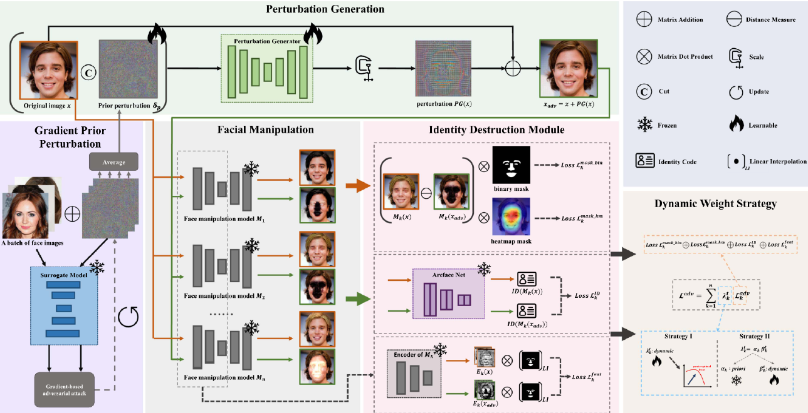

# ID-Guard: A Universal Framework for Combating Facial Manipulation via Breaking Identification (`TPAMI 2025`)

> **ID-Guard: A Universal Framework for Combating Facial Manipulation via Breaking Identification**  
>
> [Paper](https://ieeexplore.ieee.org/document/11185226) | [ArXiv](https://arxiv.org/pdf/2409.13349)

## Introduction

ID-Guard is a universal proactive defense framework against facial manipulation. This work is accepted by `TPAMI 2025`.

<div align="center">

</div>


---


## Preparation

### 1. Environment

Install dependencies in `requirements.txt`.

---

### 2. Dataset

Please download the [CelebAMask-HQ](https://github.com/switchablenorms/CelebAMask-HQ) dataset and organize them as follows:

```
dataset/
│
├── CelebAMask-HQ/
│   ├── CelebA-HQ-img/
│   ├── mask_images/
│   └── ...
```

Run the following script to convert the fine-grained facial component masks provided by CelebAMask-HQ into the binary masks used in our paper:

```bash
python data/process_dataset.py
```

The generated binary masks will be saved in the `mask_images/` directory.

### 3. Pretrained Models

#### 3.1. Pretrained AdvGenerator and prior perturbation

Download the pretrained adversarial generator weights and the optimized prior perturbation from this [Google drive link](https://drive.google.com/drive/folders/1eYoJGpxHSOWA2DUFkw_Cg7H6WN85SocM?usp=sharing). 

The downloaded package contains an `ID-Guard` directory. Please place this directory under `checkpoint/`.

#### 3.2. ID models

Download the pretrained weights for the identity feature extractors (VGGFace and ArcFace) from this [Google drive link](https://drive.google.com/drive/folders/1eYoJGpxHSOWA2DUFkw_Cg7H6WN85SocM?usp=sharing).

The downloaded package contains an `id_model` directory. Please place this directory under `checkpoint/`.

#### 3.3. Deepfake models

Getting the pretrained Deepfake models and place them under

```
checkpoint/
│
└── deepfake_model/
	│
    ├── stargan/
    ├── aggan/
    ├── fpgan/
    ├── relgan/
    └── HiSD/
```

The required pretrained models include

- [StarGAN](https://github.com/yunjey/stargan)
- [AGGAN](https://github.com/Ha0Tang/AttentionGAN)
- [FPGAN](https://github.com/mahfuzmohammad/Fixed-Point-GAN)
- [RelGAN](https://github.com/elvisyjlin/RelGAN-PyTorch)
- [HiSD](https://github.com/imlixinyang/HiSD)

---


## Usage

### 1. Training

Run the following script to train the proposed ID-Guard framework. The `--dws` argument specifies the multi-objective optimization strategy, which can be set to `MGDA` (Strategy I) or `KPI` (Strategy II). The `--id_extractor` argument specifies the identity feature extractor, which can be set to `Vgg` (VGGFace) or `Arc` (ArcFace).

```bash
python main.py --mode train --dws MGDA --id_extractor Vgg
```

### 2. Testing

Run the following script to evaluate the ID-Guard framework:

```bash
python main.py --mode test --dws MGDA --id_extractor Vgg
```

or

```bash
python main.py --mode test --dws KPI --id_extractor Arc
```

### 3. Generate Protected Images

Run the following script to generate a protective adversarial perturbation for a single face image at the specified path:

```bash
python main.py --mode test_one --test_image_path xxx
```

---


## Acknowledgements

This project benefits from several excellent open-source projects, including

- [StarGAN](https://github.com/yunjey/stargan)
- [AGGAN](https://github.com/Ha0Tang/AttentionGAN)
- [FPGAN](https://github.com/mahfuzmohammad/Fixed-Point-GAN)
- [RelGAN](https://github.com/elvisyjlin/RelGAN-PyTorch)
- [HiSD](https://github.com/imlixinyang/HiSD)
- [CelebAMask-HQ](https://github.com/switchablenorms/CelebAMask-HQ)

We sincerely thank the authors for making their code publicly available.

---


## Citation

If you find this project useful, please consider citing our paper.

```bibtex
@article{2025idguard,
  author={Qu, Zuomin and Lu, Wei and Luo, Xiangyang and Wang, Qian and Cao, Xiaochun},
  journal={IEEE Transactions on Pattern Analysis and Machine Intelligence}, 
  title={ID-Guard: A Universal Framework for Combating Facial Manipulation via Breaking Identification}, 
  year={2026},
  volume={48},
  number={2},
  pages={1720-1735},
  doi={10.1109/TPAMI.2025.3616232}
}
```

---

